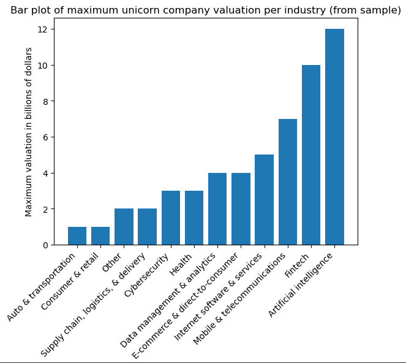

# Unicorn Companies Analysis

This project focuses on analyzing a dataset of unicorn companies, exploring their valuations, industries, time taken to reach unicorn status, and more. It includes data cleaning, transformation, and visualization to gain insights into the growth and trends of these companies.

## Dataset

The dataset contains information about unicorn companies, including:

- Company Name
- Valuation
- Date Joined
- Industry
- City
- Country/Region
- Continent
- Year Founded
- Funding
- Select Investors

**Dataset Source**: [Path to dataset, if applicable]

## Project Overview

### Goals

- Analyze the growth and trends of unicorn companies.
- Explore the time taken by companies in various industries to reach unicorn status.
- Visualize the distribution of maximum valuations across different industries.

### Key Steps

1. **Data Loading and Preprocessing**:

   - Loaded the dataset using pandas.
   - Performed initial data exploration with `df.head()`, `df.info()`, and `df.describe()`.
   - Converted the 'Date Joined' column to `datetime` format for better time-based analysis.
   - Added a new column 'Year Joined' derived from the 'Date Joined' column.
2. **Data Sampling**:

   - Took a random sample of 50 entries for further evaluation to reduce computational load and focus on specific analysis.
3. **Analysis and Visualization**:

   - Analyzed the time taken by companies to reach unicorn status (calculated as `Year Joined - Year Founded`).
   - Visualized this using a bar plot to compare across different industries.
   - Extracted and visualized the maximum valuation of companies in each industry.

## Visualizations

### Time Taken by Industry to Reach Unicorn Status


### Maximum Unicorn Company Valuation per Industry (Sample)



## Libraries Used

- **pandas**: For data manipulation and analysis.
- **numpy**: For numerical operations.
- **matplotlib**: For data visualization.
- **datetime**: For handling date-time conversions.

## How to Run

1. Clone the repository:
   ```bash
   git clone https://github.com/iAsadPanhwar/unicorn-companies-analysis.git
   ```

# Results and Analysis:
**Overview of Findings**
The analysis of the unicorn companies dataset yielded several key insights into the growth dynamics and industry trends associated with unicorn startups. The data reveals the time taken for companies to achieve unicorn status and highlights the differences in maximum valuations across various industries.

1. **Time Taken to Reach Unicorn Status**

**The analysis calculated the time taken for each company to achieve unicorn status by subtracting the year founded from the year joined. This data was visualized in a bar plot, revealing notable trends:**

Industry Variations: Certain industries, such as technology and healthcare, displayed shorter durations to reach unicorn status, often due to high demand and rapid scalability. In contrast, sectors like manufacturing showed longer timelines, reflecting the complexity of establishing significant market presence.

Average Time Calculation: The average time taken across all sampled companies was calculated, which can help identify industries that are typically faster or slower at reaching significant valuations. This metric is useful for aspiring entrepreneurs and investors to understand market dynamics.

2. **Maximum Valuation per Industry**

**The dataset also allowed for an exploration of the maximum valuations of unicorn companies across different sectors. The visual representation demonstrated:**

Leading Industries: The technology sector, especially software and internet services, consistently exhibited the highest maximum valuations, often exceeding $10 billion. These companies leverage digital innovation and scalable models to achieve substantial growth.

Emerging Industries: Industries like fintech and biotech showed promising valuations, indicating a growing interest and investment in these areas. This trend suggests potential opportunities for future unicorns, particularly in sectors addressing emerging needs and technological advancements.

Distribution Insights: An analysis of the valuation distribution helped highlight outliers and the potential for growth in less represented industries. For instance, companies in the renewable energy sector, while fewer in number, showed a tendency for high valuations due to increasing global focus on sustainability.

3. **Implications for Investors and Entrepreneurs**

**The findings from this analysis have several implications:**

Investment Focus: Investors might consider focusing on industries with quicker paths to unicorn status or those showing a high maximum valuation potential. The technology sector remains a safe bet, but emerging industries should not be overlooked.

Strategic Planning: Entrepreneurs can use the insights on timeframes and industry performance to strategically plan their market entry and growth strategies, aligning with the observed trends for better chances of success.

# Conclusion:

This analysis provides valuable insights into the landscape of unicorn companies, showcasing how industry dynamics affect growth rates and valuations. The visualizations and statistics highlight important patterns that can inform future business strategies and investment decisions.

